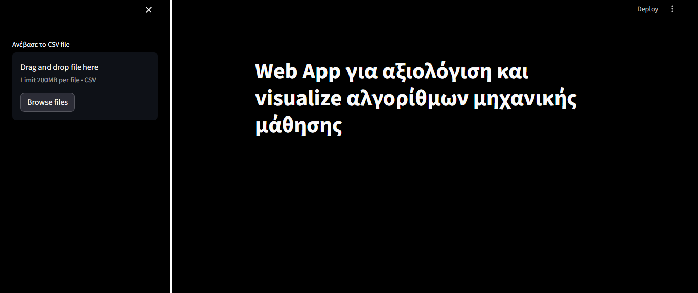
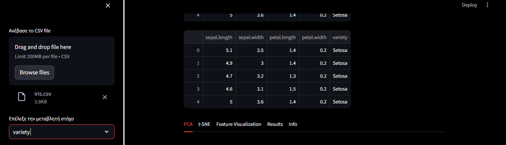
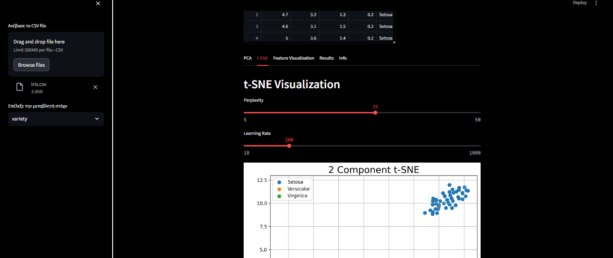
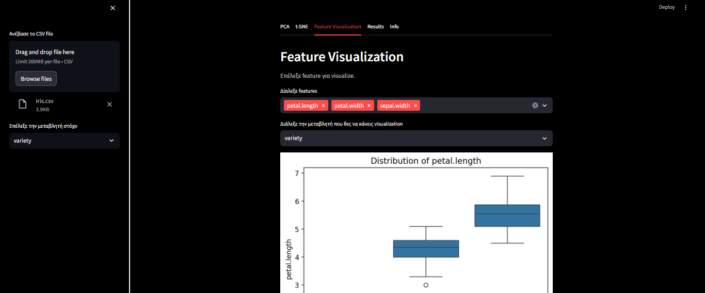
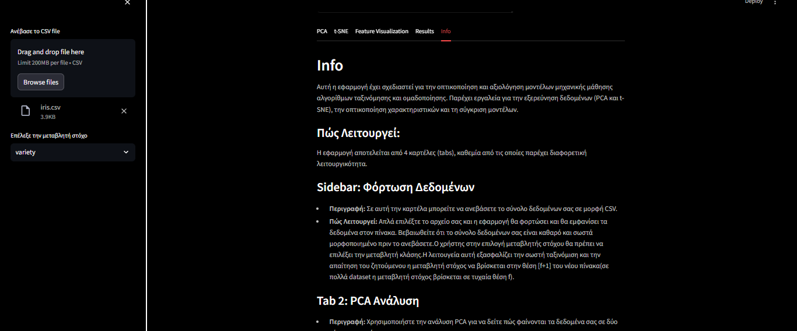
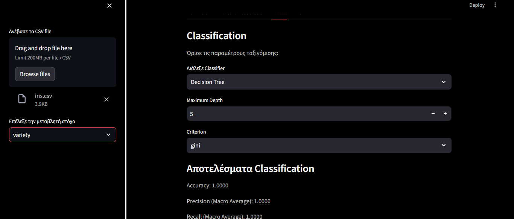

# Streamlit Web App Μπάρλας Ιωάννης Π2019009 Επί πτυχίω
A streamlit Web App for Data Analysis

## Docker installation 
### For docker installation use the commands below
#### 1.git clone 
#### 2.open terminal 
#### 3. docker build -t my-streamlit-app .
#### 4.docker run -p 8501:8501 my-streamlit-app

## IMAGES FROM WEB APP

