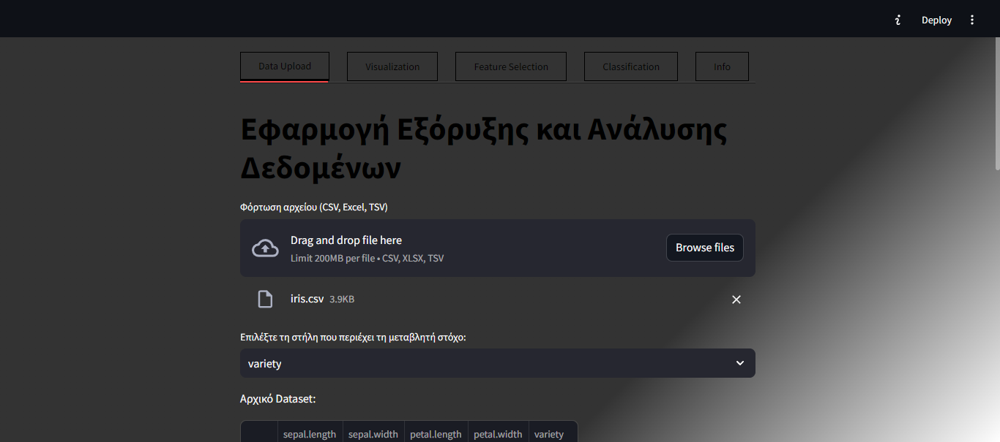
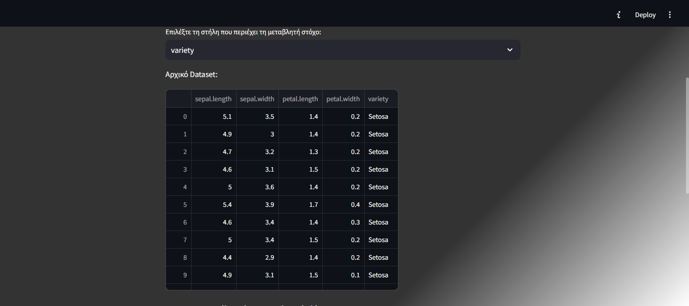
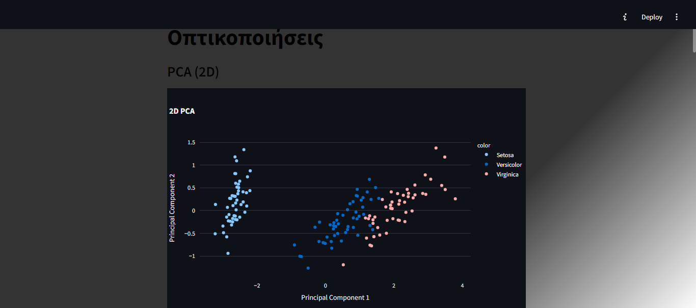
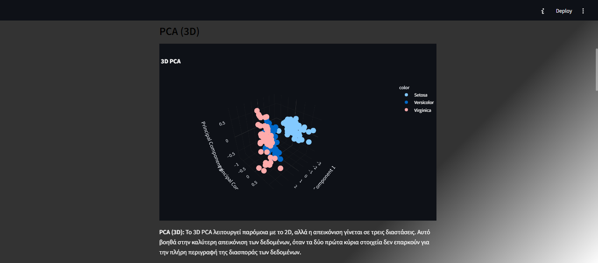
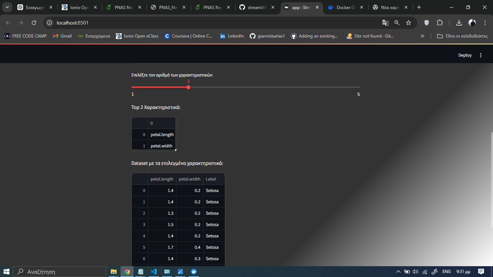
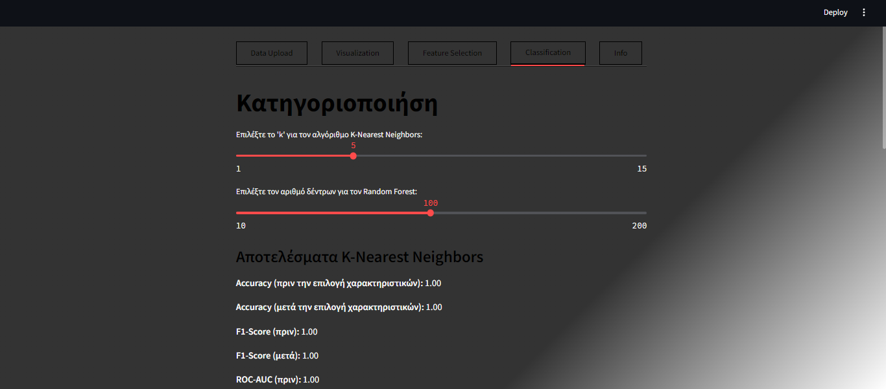
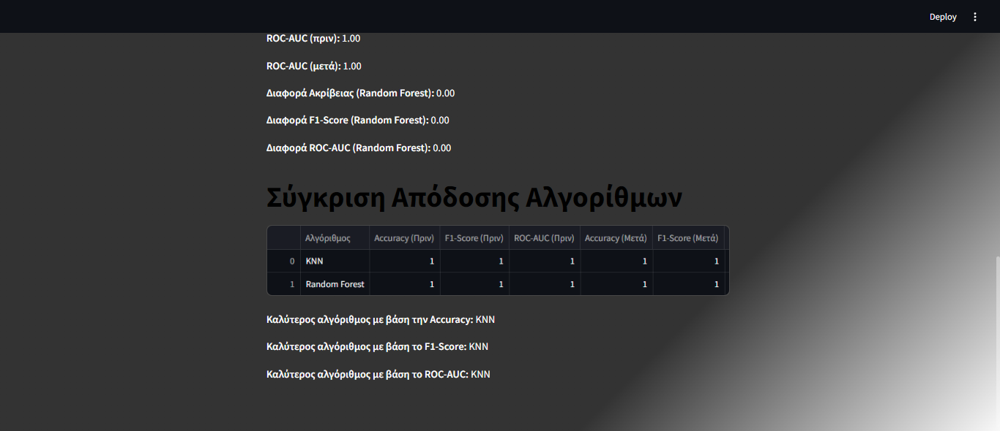
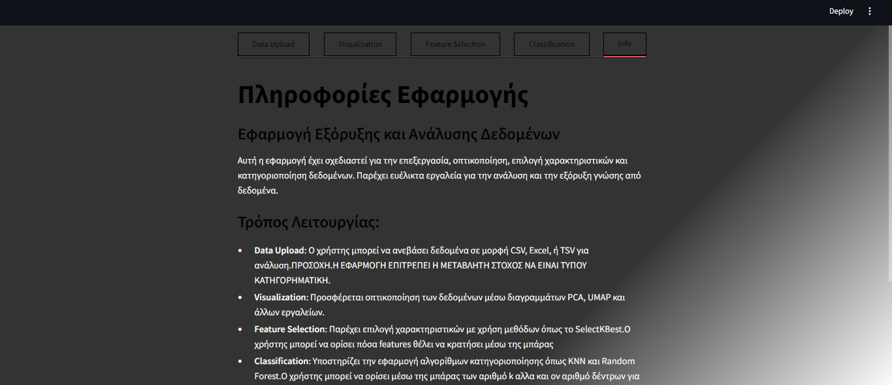

# Streamlit Web App Μπάρλας Ιωάννης Π2019009 Επί πτυχίω
A streamlit Web App for Data Analysis

## Docker installation 
### Η εφαρμογή έχει αναρτηθεί στο docker hub.Για να την αποκτήσετε μέσω docker θα χρειαστούν τα παρακάτω commands
#### docker pull p19barl/myapp:latest
#### docker run -p 8000:8000 p19barl/myapp:latest

## IMAGES FROM WEB APP

